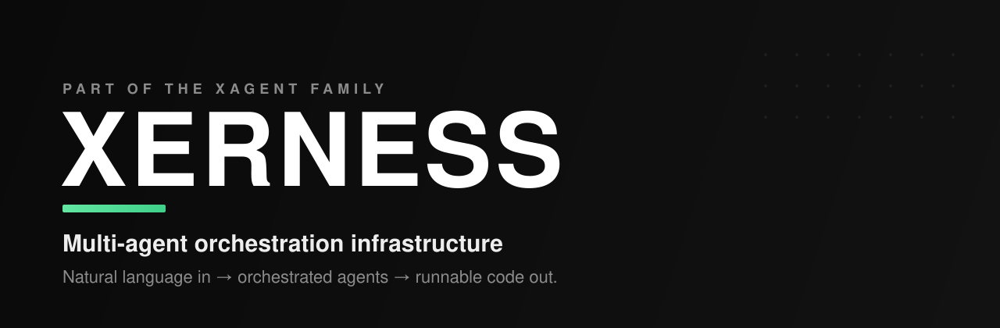
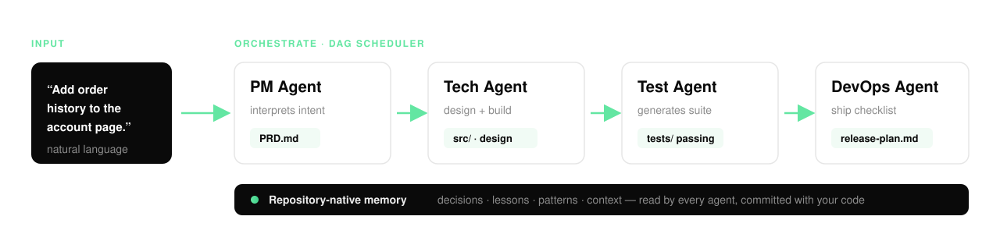

<p align="center">
  
</p>

<h1 align="center">Xerness</h1>

<p align="center">
  <b>Multi-agent orchestration infrastructure for software delivery.</b><br/>
  Describe what you want in plain language. Xerness orchestrates a team of specialized AI agents<br/>through the full development pipeline — and delivers runnable code.
</p>

<p align="center">
  <a href="./LICENSE"></a>
  
  
  <a href="https://xagt.ai"></a>
  <a href="https://x.com/XAgent_official"></a>
  
</p>

<p align="center">
  <a href="#quickstart">Quickstart</a> &nbsp;·&nbsp;
  <a href="#how-it-works">How it works</a> &nbsp;·&nbsp;
  <a href="#define-your-agents">Agents</a> &nbsp;·&nbsp;
  <a href="#orchestrate-a-workflow">Workflows</a> &nbsp;·&nbsp;
  <a href="#programmatic-api">API</a> &nbsp;·&nbsp;
  <a href="./ARCHITECTURE.md">Architecture</a> &nbsp;·&nbsp;
  <a href="./FAQ.md">FAQ</a>
</p>

---

## What is Xerness?

Modern AI coding tools — Cursor, Claude Code, Codex — make an *individual* developer faster. Xerness makes the *whole delivery pipeline* faster by treating software development as a **multi-agent problem**.

You give Xerness a requirement in natural language. It parses intent, builds an execution graph, and routes the work through specialized role agents — Product, Engineering, QA, DevOps — each producing a real, versioned artifact that flows into the next. The result is not a chat transcript; it is **runnable code, tests, and a release plan committed to your repository.**

```
"Add order history to the account page."
        │
        ▼
   PM Agent  →  Tech Agent  →  Test Agent  →  DevOps Agent
   PRD.md       src/ + design    tests/ passing   release-plan.md
        │
        ▼
   Runnable code, in your repo, with the reasoning captured as memory.
```

**Xerness is infrastructure, not a chatbot.** It ships as an npm package, runs against your own model credentials, and keeps every workflow, standard, and memory inside your Git repository. There is no server to deploy and no data leaves your control.

---

## How it works

<p align="center">
  
</p>

| Stage | Component | What happens |
|-------|-----------|--------------|
| **Parse** | `IntentParser` | Turns a natural-language request into a structured `ParsedIntent`, injecting recent git context and routing it to an entry role. |
| **Orchestrate** | `DAGScheduler` | Reads a declarative workflow (YAML DAG) and schedules role agents — parallel where possible, serial where required — passing artifacts between nodes. |
| **Execute** | `AgentLoop` | Each role agent loads its behavior definition, relevant skills, and repository memory, then calls the underlying LLM to produce a standardized artifact. |
| **Remember** | `MemoryStore` | Decisions, lessons, and patterns are written back into the repository so the next run — and the next teammate — starts with full context. |

---

## Quickstart

> **Requirements:** Node.js ≥ 20, a target Git repository, and your own model API key (Anthropic or any OpenRouter-compatible provider).

```bash
# 1. Add Xerness to your project
npm install --save-dev xerness    # or: pnpm add -D xerness

# 2. Scaffold the .agent/ workspace, default roles, and config
npx xerness init

# 3. Point Xerness at your model
echo "ANTHROPIC_API_KEY=sk-..." >> .env

# 4. Describe what you want — Xerness runs the full pipeline
npx xerness run "Add order history to the account page"
```

`xerness run` executes the workflow end to end and writes the artifacts into your repository:

```
your-repo/
├── .agent/
│   ├── agents/            # role definitions (PM / Tech / Test / DevOps)
│   ├── skills/            # standards + capabilities (SKILL.md)
│   ├── workflows/         # YAML DAGs
│   ├── memory/            # decisions · lessons · patterns · context
│   └── routing.yaml       # which prompts go to which role
├── src/                   # ← generated / modified feature code
├── tests/                 # ← generated test suite
├── PRD.md                 # ← product spec
└── release-plan.md        # ← ship checklist
```

---

## Define your agents

A role is a directory under `.agent/agents/`. Each declares its behavior, the skills it may use, and the model it runs on — no core code changes required.

```yaml
# .agent/agents/tech/agent.yaml
name: tech
role: Engineering
description: Turns a PRD into a working, tested implementation.
model: anthropic/claude-sonnet-4.6   # any OpenRouter-compatible model
skills:
  - standards/typescript-strict      # injected into the system prompt
  - standards/review-checklist
  - capabilities/shell-exec          # exposed as a callable tool
  - capabilities/http-fetch
memory:
  read:  [decisions, lessons, patterns, context]
  write: [decisions, lessons]
```

Skills come in two kinds:

- **Standards** — rules injected into the agent's system prompt (coding conventions, review checklists). They constrain *how* the agent works.
- **Capabilities** — tools registered as `tool_use` (`shell-exec`, `http-fetch`, …). They extend *what* the agent can do.

Each skill is a self-contained directory with a `SKILL.md` (YAML frontmatter + body). Fork it, extend it, share it.

---

## Orchestrate a workflow

Workflows are declarative DAGs. Nodes are role agents; edges are artifact handoffs. The scheduler decides what runs in parallel and what runs in series.

```yaml
# .agent/workflows/feature.yaml
name: feature
description: Requirement → shipped feature.
nodes:
  - id: spec
    agent: pm
    output: PRD.md

  - id: build
    agent: tech
    needs: [spec]           # consumes PRD.md
    output: [src/, design.md]

  - id: test
    agent: test
    needs: [build]
    output: tests/

  - id: ship
    agent: devops
    needs: [test]
    output: release-plan.md

  # parallel branch: docs are written while tests run
  - id: docs
    agent: tech
    needs: [build]
    output: docs/
```

```bash
npx xerness run "Add order history to the account page" --workflow feature
```

---

## Programmatic API

Prefer to drive Xerness from your own tooling or CI? Use the TypeScript API.

```ts
import { Xerness } from "xerness";

const x = new Xerness({
  repo: process.cwd(),
  model: "anthropic/claude-sonnet-4.6",
  apiKey: process.env.ANTHROPIC_API_KEY,
});

const result = await x.run({
  request: "Add order history to the account page",
  workflow: "feature",
});

console.log(result.artifacts);
// {
//   "PRD.md":          "...",
//   "src/":            ["OrderHistory.tsx", "orders.api.ts"],
//   "tests/":          ["orderHistory.test.ts"],
//   "release-plan.md": "..."
// }

for (const decision of result.memory.decisions) {
  console.log(decision.title, "→", decision.rationale);
}
```

Every run returns the artifacts it produced and the memory it wrote — so you can gate CI on it, diff it, or replay it.

---

## Architecture

Xerness is organized into four layers. See **[ARCHITECTURE.md](./ARCHITECTURE.md)** for the full component breakdown and a worked end-to-end trace.

```
┌─────────────────────────────────────────────────┐
│  Adapter        CLI · Cursor · Claude Code · …   │  normalize surfaces
├─────────────────────────────────────────────────┤
│  Orchestration  IntentParser · DAGScheduler      │  parse + schedule
├─────────────────────────────────────────────────┤
│  Execution      AgentLoop · BaseAgent · Skills   │  run role agents
├─────────────────────────────────────────────────┤
│  Infrastructure AgentClient · MemoryStore · Bus  │  LLM · memory · IO
└─────────────────────────────────────────────────┘
```

---

## Repository-native memory

Team knowledge lives **inside the repository**, not in an external wiki — so it is versioned with the code and read by agents automatically before every run.

```
.agent/memory/
├── decisions/   why a choice was made
├── lessons/     pitfalls already hit, and the fix
├── patterns/    reusable solutions
└── context/     project background
```

A new engineer — or a fresh agent — starts with the team's full operating history, not a blank slate.

---

## Why Xerness

- **Full pipeline, not a snippet.** Requirement → PRD → code → tests → release plan, as connected artifacts.
- **Declarative and inspectable.** Workflows, roles, and routing are plain YAML you can read, diff, and review.
- **Your infra, your keys.** npm package, no server, no data egress. LLM calls use your own credentials.
- **Model-agnostic.** Anthropic Claude Agent SDK by default; any OpenRouter-compatible model via config.
- **Memory that compounds.** Every run makes the next one — and the next teammate — better.
- **Meets your tools where they are.** Adapters for Cursor, Claude Code, and Codex; the standards and memory apply consistently across all of them.

---

## Status

Xerness is in **active internal use** at XerpaAI. The core orchestration layer is being prepared for open-source release; this repository is its public home and reference documentation.

| Module | Status |
|--------|--------|
| Core engine (IntentParser · DAGScheduler · AgentLoop) | Stable |
| Role system (PM / Tech / Test / DevOps) | Stable |
| Repository-native memory | Stable |
| Cursor · Claude Code adapters | Available |
| Codex adapter | In progress |
| Core-layer open source | In preparation |

See the **[open issues](https://github.com/xerpa-ai/xerness-intro/issues)** to follow along or request early access.

---

## Documentation

| Doc | What's inside |
|-----|----------------|
| **[ARCHITECTURE.md](./ARCHITECTURE.md)** | System layers, key components, a worked end-to-end trace, technology choices. |
| **[USE-CASES.md](./USE-CASES.md)** | Three concrete before/after scenarios. |
| **[FAQ.md](./FAQ.md)** | Positioning, security, commercial vs. open source, technical Q&A. |
| **[CONTRIBUTING.md](./CONTRIBUTING.md)** | How to propose changes. |
| **[SECURITY.md](./SECURITY.md)** | How to report a vulnerability. |

---

## The XAgent family

Xerness is part of **XAgent**, an ecosystem building agent-native developer infrastructure.

- **Website** — [xagt.ai](https://xagt.ai)
- **X / Twitter** — [@XAgent_official](https://x.com/XAgent_official)
- **Token** — $XAGT

---

## Contributing

Issues, discussions, and pull requests are welcome. Start with **[CONTRIBUTING.md](./CONTRIBUTING.md)**, and please review our **[Code of Conduct](./CODE_OF_CONDUCT.md)**.

## Security

Found a vulnerability? Please **do not** open a public issue — see **[SECURITY.md](./SECURITY.md)** for private disclosure.

## License

Xerness is released under the **[Apache License 2.0](./LICENSE)**.

<p align="center"><sub>Designed and maintained by the XerpaAI team · part of the XAgent family.</sub></p>
